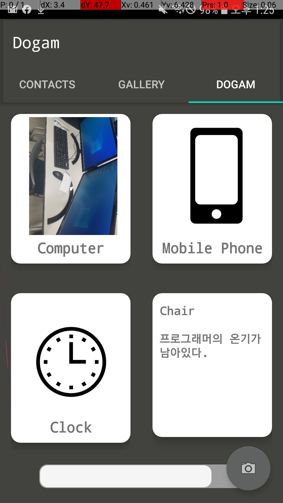
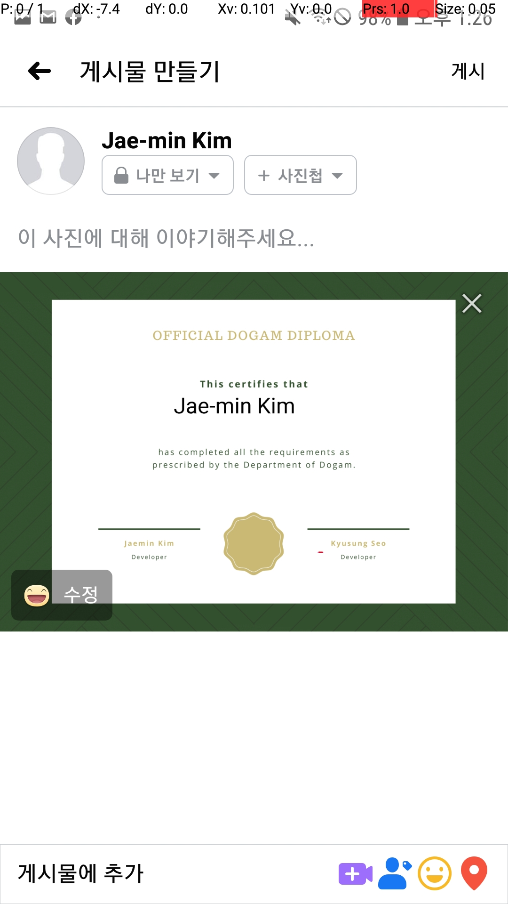

# Dogam
This is second week project of madcamp

##  Tab 1 - Contacts:
The first tab displays your contacts, allows you to modify and add them.  
You can modify the contact by clicking on it briefly or delete it by clicking on it for a long time.  
All contacts are automatically uploaded to db.

## Tab 2 - Gallery:
Requires CAMERA and WRITE_EXTERNAL_STORAGE permissions to access camera and edit files in directory.  
Spinner allows choosing a directory in internal memory.  
Image thumbnails displayed in GridView. Chosen image displayed in the ImageView.  
All images in the internal memory directories are automatically uploaded to the DB.  
On choosing a directory, the ImageView is loaded with a dummy image if the directory is empty; otherwise loaded with the first image of the directory.  
Long-press the ImageView to display a ContextMenu (can either share the current image on Facebook, or delete the current image).  
Click the camera Button to launch camera app and store in /Pictures directory.

## Tab 3 - Dogam:
This is a real-life book game inspired by Pokemon and Legends of Zelda: Breath of the Wild.  
Click the camera Button to launch camera app. The picture taken is uploaded to Firebase image recognition to get its label.  
If there exists a match with predefined labels in Dogam, upload the picture to the server and register in the Dogam.  
For discovered items, click the item card to flip it and get item details.  
The progress bar displays the current progress of your discovery. ( items found / total items )  
If you collect all the pictures, we issue a certificate containing your name and developer!

</img> 
</img> 